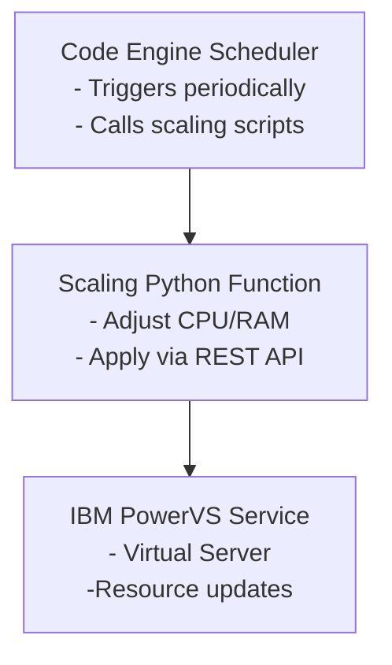

# 🕒 Scheduled PowerVS Scaling

Automate **time-based scaling** of IBM PowerVS virtual machines using **Terraform** and **IBM Cloud Code Engine**.
This project enables you to plan and execute scaling actions — such as adjusting CPU and RAM — according to a predefined schedule.
It helps you optimize both **performance** and **costs**, adapting resources to workload patterns over time.

---

## 🚀 Overview

This repository contains scripts and Terraform templates to:

- **Define scaling rules** for IBM PowerVS instances
- **Schedule scaling actions** (up or down) at specific times or days
- **Run scaling jobs** automatically via IBM Code Engine Event Subscriptions

The workflow combines **Terraform automation** with **serverless scheduling** on Code Engine,
allowing flexible and fully managed operations without maintaining dedicated infrastructure.

---

## 🧩 Architecture



---

## ⚙️ Components

| Component | Description |
|------------|-------------|
| **Terraform** | Manages the infrastructure changes (scale up/down PowerVS VMs). |
| **IBM Cloud Code Engine** | Runs scheduled function to trigger scaling actions. |
| **IBM Cloud CLI & API** | Used to interact with PowerVS resources. |
| **Bash / Shell Scripts** | Orchestrate Terraform execution and handle configuration. |

---

## 📦 Prerequisites

Before using the project, ensure you have:

- An **IBM Cloud account** with access to PowerVS resources
- **IBM Cloud CLI** installed and configured (`ibmcloud login`)
- **Terraform** installed (≥ v1.5 recommended)
- **jq**, **curl**, and **bash** available in your environment
- Permissions to create and run **Code Engine jobs**

---

## 🛠️ Setup

1. **Clone the repository:**

   ```bash
   git clone https://github.com:massimocaprinali/powervs-scheduled-scaler.git
   cd powervs-scheduled-scaler
   ```

2. **Configure variables:**

   Create the `terraform.tfvars` or environment variable files to set:

   - `ibmcloud_api_key`: IBM Cloud API Key
   - `resource_group`: IBM Cloud resource group
   - `ibmcloud_region`: IBM Cloud region
   - `workspace_name`: PowerVS workspace
   - `ibmcloud_pvs_datacenter`: PowerVS datacenter
   - `cron_expression_scale_down`: scale down schedule (cron-style expression for Code Engine)
   - `cron_expression_scale_up`: scale up schedule (cron-style expression for Code Engine)

3. **Initialize Terraform:**

   ```bash
   terraform init
   ```

4. **Deploy Resources:**

   ```bash
   terraform apply --auto-approve
   ```

5. Adjust Code Engine config-map `pvs-scale-down-config` and `pvs-scale-up-config` accordingly
```json
[
   {
      "instance_id": "xxxxxxxx-xxxx-xxxx-xxxx-xxxxxxxxxxxx",
      "instance_name": "xxxx",
      "cpu": n,
      "ram": n
   },
   ...
]
```

)

---

## 🕹️ Usage

Once deployed:

- The Code Engine job runs automatically according to your defined schedule.

---

## 📈 Example Use Cases

- Scale up compute power during business hours and scale down at night.

- Allocate additional resources for weekend batch jobs.

- Automate environment warm-up before scheduled workloads.

---

## 🧰 Folder Structure

```bash
.
├── LICENSE
├── main.tf
├── providers.tf
├── pvs-scale-current-fn
│   ├── __main__.py
│   └── requirements.txt
├── pvs-scale-fn
│   ├── __main__.py
│   └── requirements.txt
├── README.md
├── variables.tf
└── versions.tf
```

---

## 🔐 Security Notes

Avoid committing credentials or API keys.

Use IBM Cloud IAM API keys stored securely (e.g., in Code Engine secrets).

Limit permissions to only required PowerVS instances.

---

## 📜 License

This project is licensed under the MIT License. See LICENSE file

---

## 💡 Contributions

Contributions, issues, and feature requests are welcome!
Feel free to open a pull request or issue in this repository.
