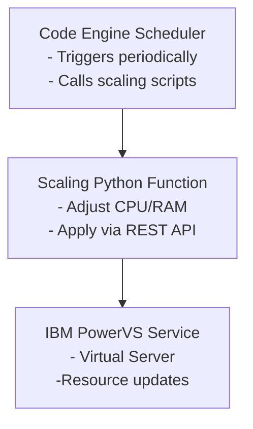

# 🕒 Scheduled PowerVS Scaling

Automate **time-based scaling** of IBM PowerVS virtual machines using **Terraform** and **IBM Cloud Code Engine**.
This project enables you to plan and execute scaling actions — such as adjusting CPU and RAM — according to a predefined schedule.
It helps you optimize both **performance** and **costs**, adapting resources to workload patterns over time.

---

## 🚀 Overview

This repository contains scripts and Terraform templates to:

- **Define scaling rules** for IBM PowerVS instances
- **Schedule scaling actions** (up or down) at specific times or days
- **Run scaling jobs** automatically via IBM Code Engine Event Subscriptions

The workflow combines **Terraform automation** with **serverless scheduling** on Code Engine,
allowing flexible and fully managed operations without maintaining dedicated infrastructure.

---

## 🧩 Architecture



---

## ⚙️ Components

| Component                 | Description                                                     |
| ------------------------- | --------------------------------------------------------------- |
| **Terraform**             | Manages the infrastructure changes (scale up/down PowerVS VMs). |
| **IBM Cloud Code Engine** | Runs scheduled function to trigger scaling actions.             |
| **IBM Cloud CLI & API**   | Used to interact with PowerVS resources.                        |
| **Bash / Shell Scripts**  | Orchestrate Terraform execution and handle configuration.       |

---

## 📦 Prerequisites

Before using the project, ensure you have:

- An **IBM Cloud account** with access to PowerVS resources. See [Required permissions](#-required-permissions)
- **IBM Cloud CLI** installed
  - Linux: `curl -fsSL https://clis.cloud.ibm.com/install/linux | sh`
  - MacOS: `curl -fsSL https://clis.cloud.ibm.com/install/osx | sh`
  - Windows™: `iex (New-Object Net.WebClient).DownloadString('https://clis.cloud.ibm.com/install/powershell')`
  - WSL2 on Windows™: `curl -fsSL https://clis.cloud.ibm.com/install/linux | sh`
- **IBM Cloud CLI Code Engine plugin** installed (`ibmcloud plugin install ce`)
- **IBM Cloud CLI Container Registry plugin** installed (`ibmcloud plugin install cr`)
- **Terraform** installed (≥ v1.6 recommended)
- **jq**, **curl**, and **bash** available in your environment

---

## 🚦 Required permissions

You must be assigned one or more IAM access roles that include the following action. You can check your access by going to [Users](<[https://](https://cloud.ibm.com/iam/users)>) > User > Access.

| Service                   | Permissions                                                                                                                                                   |
| ------------------------- | ------------------------------------------------------------------------------------------------------------------------------------------------------------- |
| **Resource Manager**      | - resource-controller.group.retrieve                                                                                                                          |
| **Resource Controller**   | - resource-controller.instance.retrieve<br>- resource-controller.instance.create                                                                              |
| **Code Engine**           | - codeengine.tenant.entities.read<br>- codeengine.tenant.entities.create                                                                                      |
| **IAM Identiy Services**  | - iam-identity.serviceid.get<br>- iam-identity.serviceid.create<br>- iam-identity.apikey.list<br>- iam-identity.apikey.create<br>- iam-identity.apikey.delete |
| **IAM Policy Management** | - iam.policy.read<br>- iam.policy.create<br>- iam.policy.delete                                                                                               |
| **Power Cloud**           | - power-iaas.cloud-instance.modify<br>- power-iaas.cloud-instance.read<br>- power-iaas.workspace.read<br>                                                     |

---

## 📋 Inputs

| Name                         | Description                                                                                                      | Type     | Default        | Required |
| ---------------------------- | ---------------------------------------------------------------------------------------------------------------- | -------- | -------------- | :------: |
| `ibmcloud_api_key`           | IBM Cloud API key                                                                                                | `string` | n/a            |    ✅    |
| `ibmcloud_region`            | IBM Cloud Region                                                                                                 | `string` | `"eu-de"`      |    ❌    |
| `ibmcloud_pvs_datacenter`    | IBM Cloud datacenter for IBM PowerVS workspace                                                                   | `string` | `"eu-de-1"`    |    ❌    |
| `prefix`                     | A unique identifier for resources. Must begin with a lowercase letter and end with a lowercase letter or number. | `string` | `"pvs-scale"`  |    ❌    |
| `resource_group`             | Resource group where resources will be created                                                                   | `string` | n/a            |    ✅    |
| `code_engine_project_name`   | The name of the Code Engine project                                                                              | `string` | `null`         |    ❌    |
| `workspace_name`             | IBM PowerVS workspace name                                                                                       | `string` | n/a            |    ✅    |
| `cron_expression_scale_down` | Cron expression for scale down events (UTC)                                                                      | `string` | `"0 20 * * *"` |    ❌    |
| `cron_expression_scale_up`   | Cron expression for scale up events (UTC)                                                                        | `string` | `"0 6 * * *"`  |    ❌    |
| `enable_project_replace`     | Enable or disable Code Engine project replacement                                                                | `bool`   | `true`         |    ❌    |

---

## 📤 Outputs

| Name                       | Description                         | Sensitive |
| -------------------------- | ----------------------------------- | :-------: |
| `pvs_current_state_fn_url` | Endpoint for current state function |    ❌     |
| `pvs_scale_down_fn_url`    | Endpoint for scale down function    |    ❌     |
| `pvs_scale_up_fn_url`      | Endpoint for scale up function      |    ❌     |

---

## 🛠️ Setup

1. **Clone the repository:**

   ```bash
   git clone https://github.com/IBM/powervs-scheduled-scaler.git
   cd powervs-scheduled-scaler
   ```

2. **Configure variables:**

   Create the `terraform.tfvars` or environment variable files to set:

   - `ibmcloud_api_key`: IBM Cloud API Key
   - `resource_group`: IBM Cloud resource group
   - `ibmcloud_region`: IBM Cloud region
   - `workspace_name`: PowerVS workspace
   - `ibmcloud_pvs_datacenter`: PowerVS datacenter
   - `cron_expression_scale_down`: scale down schedule (cron-style expression for Code Engine)
   - `cron_expression_scale_up`: scale up schedule (cron-style expression for Code Engine)

3. **Initialize Terraform:**

   ```bash
   terraform init
   ```

4. **Deploy Resources:**

   ```bash
   terraform apply --auto-approve
   ```

5. Adjust Code Engine config-map `pvs-scale-down-config` and `pvs-scale-up-config` accordingly

```json
[
   {
      "instance_id": "xxxxxxxx-xxxx-xxxx-xxxx-xxxxxxxxxxxx",
      "instance_name": "xxxx",
      "cpu": n,
      "ram": n
   },
   ...
]
```

)

---

## 🧹 Destroying / Cleaning Up Resources

If you no longer need the resources deployed by this project, you can destroy them safely using Terraform. Follow these steps:

1. **Navigate to the Terraform project directory** (where your `main.tf`, `providers.tf`, etc. are located).
2. **Run terraform destroy**

   ```bash
   terraform destroy --auto-approve
   ```

3. **Remember to hard delete Code Engine Project**

   ```bash
   ibmcloud ce proj delete --name pvs-scale --hard
   ```

---

## 🕹️ Usage

Once deployed:

- The Code Engine job runs automatically according to your defined schedule.

---

## 📈 Example Use Cases

- Scale up compute power during business hours and scale down at night.

- Allocate additional resources for weekend batch jobs.

- Automate environment warm-up before scheduled workloads.

---

## 🧰 Folder Structure

```bash
.
├── LICENSE
├── README.md
├── main.tf
├── providers.tf
├── pvs-scale-current-fn
│   ├── __main__.py
│   └── requirements.txt
├── pvs-scale-fn
│   ├── __main__.py
│   └── requirements.txt
├── terraform.tfvars.template
├── usage.gif
├── variables.tf
└── versions.tf
```

---

## 🔐 Security Notes

Avoid committing credentials or API keys.

Use IBM Cloud IAM API keys stored securely (e.g., in Code Engine secrets).

Limit permissions to only required PowerVS instances.

---

## 📜 License

This project is licensed under the MIT License. See [LICENSE](LICENSE) file

---

## 💡 Contributions

Contributions, issues, and feature requests are welcome!
Feel free to open a pull request or issue in this repository.
